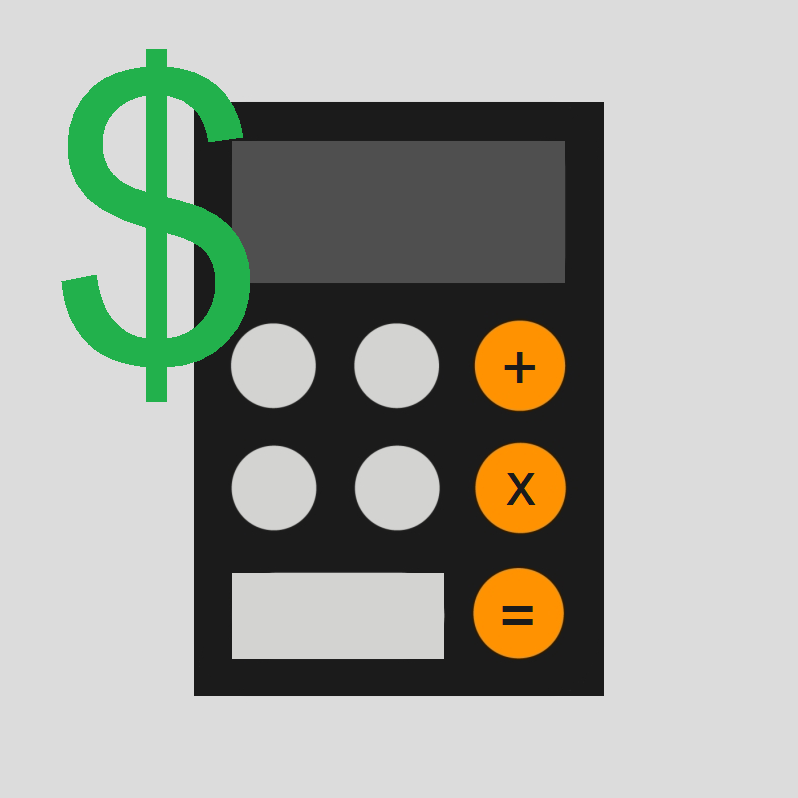

Financial analysis software for valuation of various securities.

<h2>Valuation Methods</h2>

<b>Fixed Income Securities:</b>

<ul>
<li>Plain vanilla bonds are valued with a Discounted Cash Flows (DCF) model.</li>
<li>Callable bonds are valued by subtracting the price of the embedded call option, valued with the Black Model, from the corresponding non-callable DCF price of the bond.</li>
<li>Flat-rate perpetuities are valued with a simple geometric summation.</li>
<li>Zero-coupon bonds are valued by discounting the face value payment.</li>
</ul>

<b>Options:</b>

<ul>
<li>European options are valued using the relevant Black-Scholes derived formula.</li>
<li>American options are valued using a trinomial tree estimate of the Black-Scholes price.</li>
</ul>

<h2>Values Calculated</h2>

<b>For Fixed Income Securities:</b>

<ul>
<li>Price / Valuation</li>
<li>Macaulay Duration</li>
<li>Modified Duration</li>
<li>Effective Duration</li>
</ul>

<b>For Options:</b>

<ul>
<li>Price / Valuation</li>
</ul>

<h2>Authors</h2>

Hussam Elhamy Elnashar  
Ahmed Yasser Mohammed  
