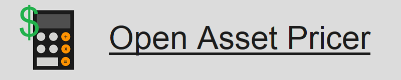

<h2>Download</h2>
<a href="https://github.com/HNash/OpenAssetPricer/releases/download/v0.7/v0.7.zip">Download link</a> for the latest pre-release (v0.7).

<h2>Valuation Methods</h2>

<b>Fixed Income Securities:</b>

<ul>
<li>Plain vanilla bonds are valued with a Discounted Cash Flows (DCF) model.</li>
<li>Callable bonds are valued by subtracting the price of the embedded bond call option, valued with the Black-76 formula, from the corresponding non-callable DCF price of the bond.</li>
<li>Convertible bonds are valued by adding the price of the embedded American stock call option, valued with the trinomial tree estimate of the Black-Scholes price, to the corresponding non-convertible DCF price of the bond.</li>  
<li>Zero-coupon bonds are valued by discounting the face value payment.</li>
<li>Flat-rate perpetuities are valued with a simple geometric summation.</li>
</ul>

<b>Options:</b>

<ul>
<li>European options are valued using the relevant Black-Scholes closed form solution.</li>
<li>American options are valued using a trinomial tree estimate of the Black-Scholes price.</li>
<li>Bond options are valued using the Black-76 formula.</li>
</ul>

<h2>Values Calculated</h2>

<b>For Fixed Income Securities:</b>

<ul>
<li>Price / Valuation</li>
<li>Macaulay Duration (where applicable)</li>
<li>Modified Duration (where applicable)</li>
<li>Effective Duration, calculated with the Finite Difference Method (where applicable)</li>
</ul>

<b>For Options:</b>

<ul>
<li>Price / Valuation</li>
</ul>

<h2>Authors</h2>
<b>Hussam Elhamy Elnashar</b>
<ul>
<li>Development and implementation of portfolio functionality.</li>
<li>Development and implementation of Fixed Income securities valuation and duration calculations.</li>
<li>Development and implementation of Option valuation and duration calculations.</li>
<li>Development and implementation of GUI.</li>
</ul>
<b>Ahmed Yasser  Figram</b>
<ul>
<li>Development of European option valuation.</li>
</ul>
